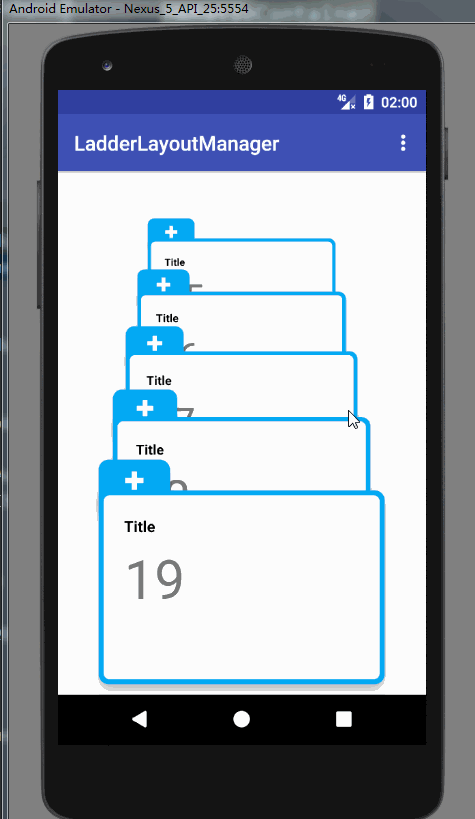
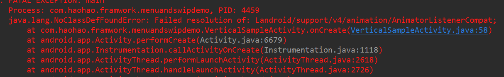
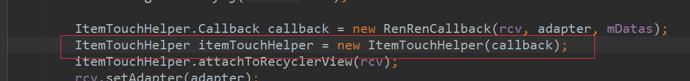

# MenuAndSwipDemo

## 效果图：

  

使用RecyclerView，通过自定义LayoutManger和自定义ItemTouchHelper.Callback控制item位置和滑动实现。

注意：

有时会报错：

 

源于这部分代码：

这是由于`com.android.support:appcompat-v7`的版本引起的，建议换到26以下：

~~~~JAVA
implementation 'com.android.support:appcompat-v7:25.4.0'
~~~~

